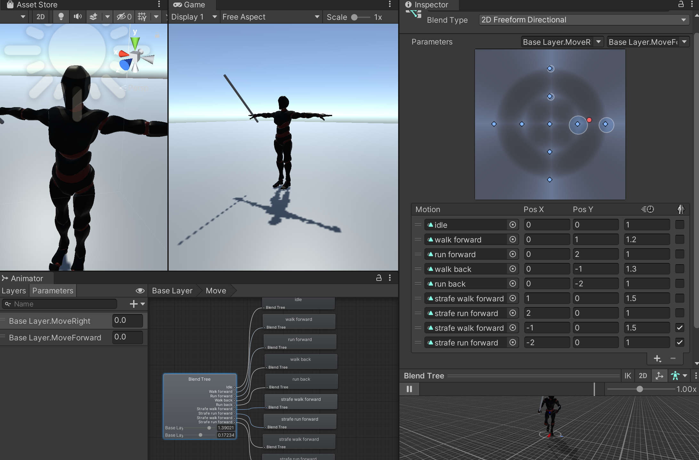
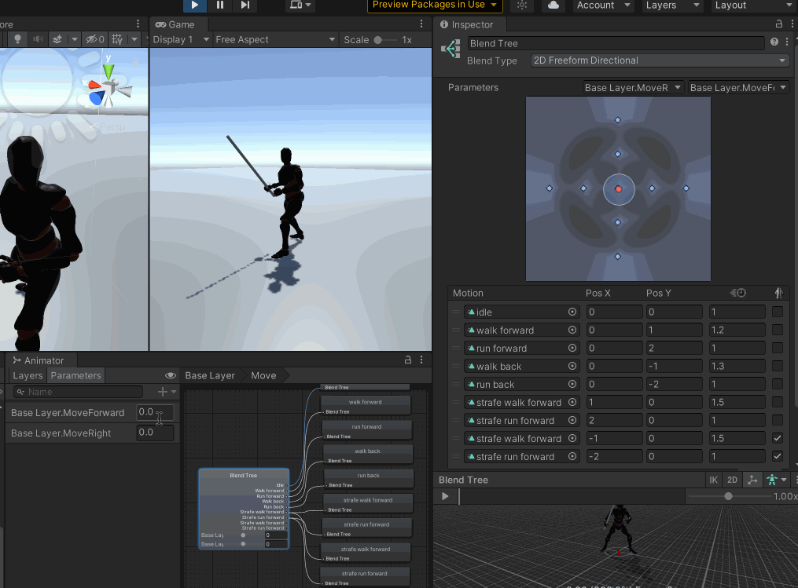
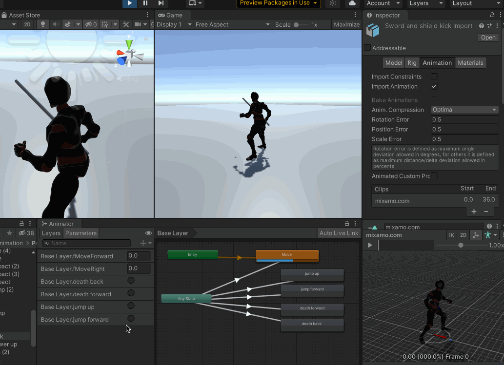
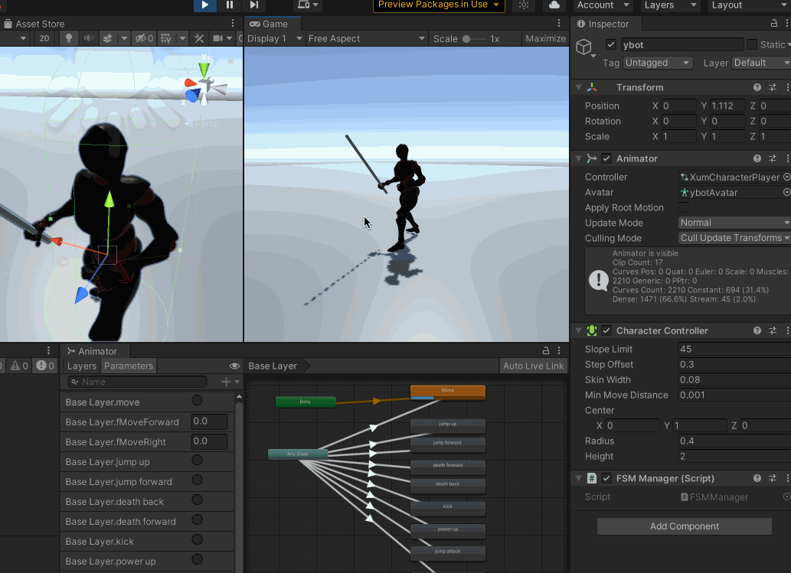

## 20210907

添加一个Virtual Camera，将Follow、Look At 都设置为【ybot】

在【ybot】的mixamorig:RightHandThumb1 下添加一个Cylinder 作为玩家的武器，调节其位置、旋转，使其与角色看起来更符合视觉效果

取消勾选【ybot】Animator 组件上的Apply Root Motion 选项

动画状态机中，使用一个2D Blend Tree，来实现idle、前行、后行、前跑、后跑、左行、右行、左跑、右跑的融合

所有的进行如下配置，否则实际运动的方向、动作循环效果是不正确的

* 勾选Loop Time
* Root Transform Rotation 勾选Back Into Pose、Based Upon 选择Original

所有动作的Source 都选择对应模型的Avatar（这块的影响是什么？）

## 20210921

需要添加以下功能

1. 多个Idle 状态之间可以随机切换，使得动画的表现性更强
2. 暂时不用StateMove 这个做移动，单独用idle、walk forward、run forward
3. 实现鼠标右键长按拖动时，视角围绕主角移动
4. 添加敌人的AI 控制其移动、攻击等行为
5. 添加“攀爬”动作

## 动画/模型资源

使用的动画资源、模型来自mixamo

* 模型：ybot
* 动画：Male Locomotion Pack
* 动画：Pro Sword and Shield Pack

## 技术列表

* Animator Controller
	* Layer
	* Avatar Mask
	* 2D Blend Tree
	* Sub-State Machine
	* StateMachineBehaviour
	* 动画事件
	* Animator Override Controller
* Lerp() 实现变量的缓和化，以实现动作融合切换的平滑效果
* IK
* 协程
* Character Controller
* Animation Rigging
* DOTWeen
* Cinemachine
* Timeline
* 碰撞检测：射线检测……
* Shader
* UnityEvent

设计模式

* 状态机模式
* 事件/消息模式
* MVC 实现数值配置化

## 想要哪些动作效果

基础动作

* 【WASD】按键控制角色的前后左右走动
* 【Shift】+【WASD】控制角色的前后左右跑动
* 【Space】键控制角色跳跃
* 【鼠标左键】按键控制角色的攻击
* 被攻击血掉完后，播放死亡动画
* 被攻击到的时候，如果没有防住的话，播放受伤动画

复杂的动作组合

* 上半身做攻击动作，下半身行走
* 在合适的时机连续按三次【K】可以发大招攻击

完善的逻辑

* 键鼠、手柄的用户交互设计与实现
* 攻击的时候带音效、特效、UI 更新、屏幕震动……
* 技能、Buff、数值等支持配置，启动时加载

## 常见问题以及解决方案

在2D Blend Tree 中，可能会出现如下的“鬼畜”现象，两个动作的融合效果并不好

>解决方案：

使用Trigger 触发jump forward 这个动画播放的时候，看到角色的脚乱掉了

>解决方案：

比如加了一个踢腿的动作，在播放动画的时候，另外一只脚陷到地下，显然穿模了，影响游戏体验，这个怎么调整，让动作视觉效果看起来更加好

>解决方案：
