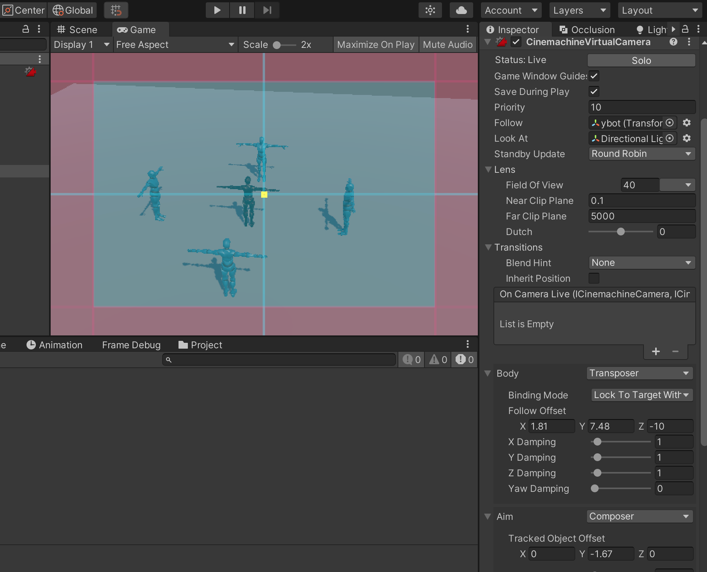

参考[https://github.com/mixandjam/Batman-Arkham-Combat](https://github.com/mixandjam/Batman-Arkham-Combat)

思考这几个点

1. 用哪些基础动作
2. 攻击者与被攻击者如何配合
3. 反思别人的动画状态机是怎么设计的
4. 脚本编写用到了哪些技术
5. 用到了哪些特效、音效
6. 如何用状态机模式崇高

## 动画资源与配置

模型使用我找的其他的模型

这个项目中的动画资源想用于ybot 还不能直接用，根据这个项目用到的动画，对应去mixmo 找相应的动画，放在Combat Pack 文件夹中

* Head Hit：头部被击中
* Dodging：类似拳击中的闪躲动作
* Cross Punch: 斜冲拳
* Punching
* Crescent Kick/Inside Crescent：跳踢
* Flip Kick：向前翻转后踢腿
* Flying Knee Punch：
* Flying Kick：
* Flying Back Death：被踢飞后死亡
* Fight Idle/Bouncing Fight/Mma Idle：站立时，抬拳防守状态
* Walking：各种行走动作
* Running：各种跑步动作
* Walking Backwards：呈防守式后撤

一些技巧

* 通过调整Animator 中每个状态的speed 来调整动画效果
* Blend Tree 实现动画混合

首先参考Batman-Arkham-Combat 项目的EnemyAnimator、AnimatorController_Jamo，复刻对方的动画状态机、好好理解其中的每个动作、变量

在配置动画的过程中可能遇到一些问题，整理了解决方案：[好好玩游戏：Copy From Other Avatar 报错解决方案](http://www.xumenger.com/unity-animator-avatar-20210925/)

## Cinemachine

【Cinemachine】=>【Create Virtual Camera】，进行如下Follow、Look At 等设置



参考[好好玩游戏：Cinemachine 实现角色跟随](http://www.xumenger.com/cine-machine-20210914/)、[好好玩游戏：Cinemachine 与Timeline 实现镜头融合](http://www.xumenger.com/cine-machine-20210915/) 调整至合适的视角

## 实现自由战斗的思路

>[Unity教程 复刻蝙蝠侠式自由战斗系统，源码见简介 mix and jam](https://www.bilibili.com/video/BV1zM4y157rt)

首先我们有负责监测敌人和激活动画的基本战斗功能

然后是增加移动和攻击的敌人行为，允许为玩家实施反制系统

最后，有一个基础的AI，来管理敌人的状态，以创建一个简化的战斗循环

* 首先使用Unity 高清渲染管线创建一个新项目
* 然后将官方的Jam 模型角色导入到项目中，其中包括一个用于原型制作的简单运动脚本
* 还制作了具有不同皮肤的角色克隆来代表不同的敌人

自由战斗的主要功能之一是它允许你通过移动控制器的操纵杆来选择要击中的目标，因此通过使用Input System，能够获取角色移动轴的值以识别其相对于相机的方向

```c#
inputDirection = camForward * movementInput.moveAxis.y + camRight * movementInput.moveAixs.x;
inputDirection = inputDirection.normalized;
```

然后使用该值来定义球体投射的方向，以检测是否有任何敌人将其存储为脚本的当前目标？

```c#
if (Physics.SphereCast(transform.position, 3f, inputDirection, out info, 10, layerMask))
{
    if (info.collider.transform.GetComponent<EnemyScript>().IsAttackable())
    {
        currentTarge = info.collier.transform.GetComponent<EnemyScript>();
    }
}
```

通过这个基础检测，我需要在攻击输入后实现玩家向目标移动，这里使用DOTween 这个插件！通过使用允许我在特定持续时间内同时查看和移动目标的功能来简化流程

```c#
void MoveTowardsTarget(EnemyScript target, float duration)
{
    transform.DOLookAt(target.transform.position, 0.2f);
    transform.DOMove(TargetOffset(target.transform), duration);
}
```

在操作期间，我还创建了一个隔离区，作为冷却时间，让玩家能够再次进行攻击过程，这个coroutine 会禁用玩家移动并激活攻击敌人的功能一段时间

为了实现攻击动画，在mixamo 下载一些拳击和踢腿动画

对于每个下载的动画，必须检查它们的关键帧并在运动的接触时刻设置特定的动画事件，这个动画事件会触发一个所有敌人都在监听的函数

```c#
playerCombat.OnHit.AddListener((x) => OnPlayerHit(x));
```

但是，如果命中本身与战斗脚本中的当前目标相同，则该命中本身仅对敌人有效

```c#
void OnPlayerHit(EnemyScript target)
{
    if (target == this)
    {
        // Hit Logic
        animator.SetTrigger("Hit");
    }
}
```

为了增加对攻击的影响，我添加了一个例子系统，该系统使用具有失真设置的材质、未点亮的材质。实现攻击波效果

然后我通过首次添加移动选项开始研究敌人的行为，为了让玩家循环而不是左右移动，敌人会不断地看着玩家，然后使用与面向方向垂直的方向进行移动

移动敌人的函数也允许他们前后移动，为了让敌人攻击玩家，我让他们使用移动功能到达玩家，一旦他们处于特定距离，就会激活它们的攻击动画，它使用相同的动画事件功能向玩家脚本发送消息

```c#
if (Vector3.Distance(transform.position, playerCombat.transform.position) < 2)
{
    StopMoving();
    Attack();
}
```

这时候，开始实现让玩家反击敌人攻击的行为，在同一个场景中敌人向前移动被激活

```c#
public void SetAttack()
{
    PrepareAttackCoroutine = StartCoroutine(PrepAttack());

    IEnumerator PrepAttack()
    {
        PrepareAttack(true);
        yield return new WaitForSeconds(0.2f);
        moveDirection = Vector3.forward();
        isMoving = true;
    }
}
```

在战斗游戏中，一旦你消灭了最后一个敌人，镜头就会放大动作并减慢时间，通过一个新的Cinemachine 虚拟相机来实现这个功能

它使用CinemachineTargetGroup 组件来构建新的玩家和特定目标

所以在玩家集中最后一个敌人的那一刻，创建一个隔离区来减少时间尺度，并激活第二个虚拟摄像头

```c#
IEnumerator FinalBlowCoroutine()
{
    Time.timeScale = 0.5f;
    lastHitCamera.SetActive(true);
    lastHittFocusObject.position = lockedTarget.transform.position;
    yield return new WaitForSecondsRealtime(2);
    lastHitCamera.SetActive(false);
    Time.timeScale = 1f;
}
```

最后，为了让所有系统能够正常播放，需要实现一个简化的AI，为此，我设置了四种不同的状态，敌人可以处于空闲（idle）、攻击（attacking）、撤退（retreating）和循环（circulating）

对于主AI 循环，脚本基本上将随机敌人设置为攻击状态或将其他敌人设置为空闲或循环，然后AI 循环等待，直到攻击敌人完成他们的动作，将其设置为撤退状态，以与另一个随机敌人重复循环