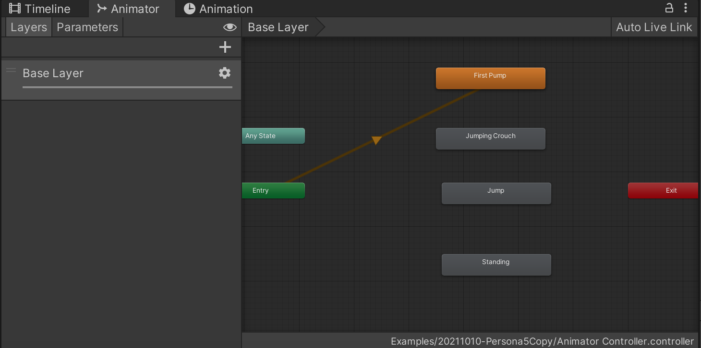

>[【Unity项目】U3D教程实现《女神异闻录5》总攻击技能效果（附工程源码）](https://www.bilibili.com/video/BV1T4411S7a4)

## 图片、动作与模型（mixamo）

模型还是使用ybot

动作包括如下：

* Jumping Crouch：从空中跳下来落地后蹲下
* Jump：跳到空中，没有在mixamo 找到对应的动画，直接复用mix and jam 项目中的动画
* Fist Pump：握拳Pose，庆祝胜利
* Standing：从蹲下站起来

图片资源，直接使用mix and jam 项目中的Images 文件夹下的图片，命名文件夹为Pictures

材质直接将mix and jam 项目中的Materials 下的材质拷贝过来，并且升级为URP 

将Prefabs 下面的Dust.prefab 粒子特效也先直接拷贝过来

mirror 这个模型也直接拷贝过来，放到我的项目中使用！

## 动画状态机

创建一个Animator Controller，制作一个动画状态机如下

为角色添加这个动画状态机

## Cinemachine/Timeline

使用Cinemachine，可以为以后的电影剪辑添加几个虚拟摄像头

然后在Timeline 窗口上构建序列，通过Timeline，可以轻松地在他们之间设置动画和过渡

参考mix and jam 的项目做好Timeline 的配置，包括动画、粒子特效、脚本、Cinemachine（镜头）等在Timeline 的序列配置，这个值得好好研究

## 配色

红色的背景，黑色的角色模型，这种的视觉冲击效果也是很好的，所以配色也是一大关键所在

所以渲染、材质、贴图是提升游戏的质感的一大关键所在！

## Unity 动画与模型配置

并不是必须将模型和动作都设置为Humanoid，设置为Generic 的话，动作和模型也是可以匹配的！如果将模型设置为Humanoid，而动作并不是fbx 格式的，而是在Unity 中使用Animation 制作的动画，那么反而会出现模型和动画无法匹配

在这个项目中就出现了将fbx 的模型、动画设置为Humanoid，他们之间可以匹配并正确播放，但是当使用Animation 制作的动画时就失效的问题！

关于Humanoid、Generic 的使用及背后的原理还是要再好好研究！

## 简单总结

这个项目是很好的学习粒子特效、Timeline、Cinemachine、镜头设计的案例！

代码中有大量关于DOTween 的使用，但是这个是我目前看不太懂的地方！
