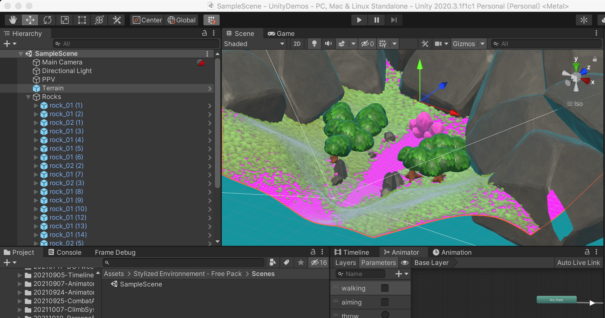
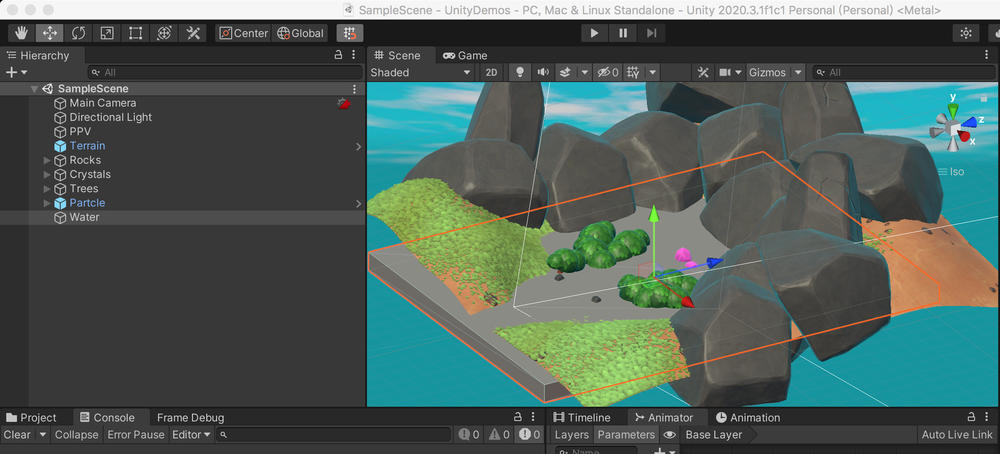
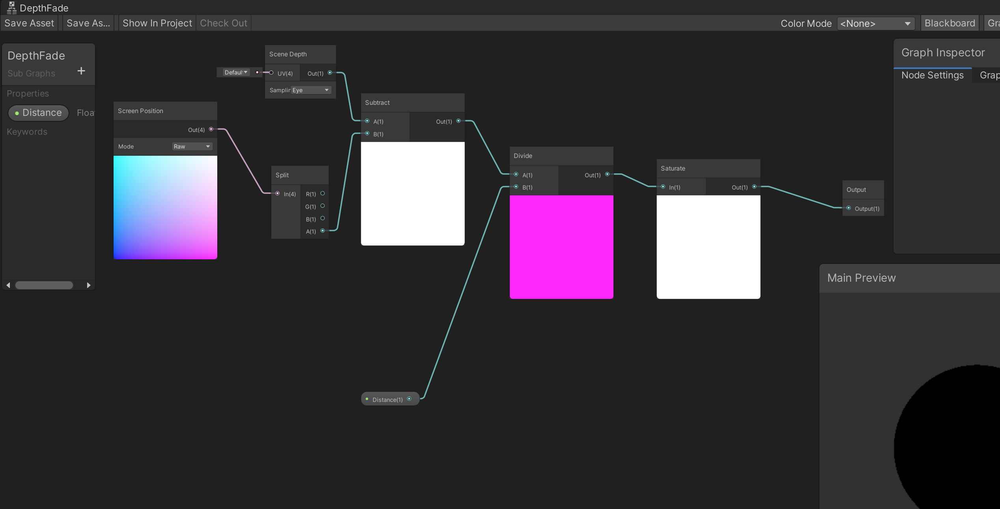

>[Unity 2021制作风格化水折射和泡沫效果！](https://www.bilibili.com/s/video/BV1LP4y1L7T8)

关于Shader 我一直没有动手去做，其实做软件，最重要的就是要大量动手写代码、调试！

基于Unity 的URP 渲染管线来实现水的渲染效果！

使用[Stylized Environment - Free Pack](https://assetstore.unity.com/packages/3d/environments/fantasy/stylized-environnement-free-pack-178090) 这个资源包！

后续在这个包的SampleScene 中测试水的材质效果，具体的材质、Shader 则还是放在当前的工程目录下！

Edit => Render Pipeline => Universal Render Pipeline => Upgrade Project Materials to UniversalRP Material

以上只是会把场景中的所有游戏对象的材质进行更新为URP，但是地形的材质还是有问题，还是显示为紫粉色

选中Hierarchy 中的Terrain，然后在Inspector 上点击齿轮，编辑地形的属性，将Material 属性从Default-Material 更换为一个适合的材质！

Edit => Project Settings => Graphics => 选中Scriptable Render Pipeline Settings 上的配置，双击，勾选Depth Texture、Opaque Texture

## 开始搭建场景

在场景中创建一个Cube，将其拉大到足够大，做出来水面的效果，后续创建的材质就是要应用到这个Cube 上

在Project 窗口，右键 => Create => Shader => Sub Graph，命名为DepthFade，如下图，但是讲实话，这里面每个节点的作用我还是不够清楚

在Project 窗口，右键 => Create => Shader => Universal Render Pipeline => Unlit Shader Graph，命名为StylizedWater，用这个Shader 来具体创建材质

在Project 窗口，右键 => Create => Shader => Sub Graph，命名为Movement，用于实现水面的涟漪移动效果

关于这个Shader Graph 实现风格化水体渲染

现在的问题是，对于大量的Shader Graph 的节点的作用完全不清楚，比如

* Gradient Noise
* Step
* Lerp
* Screen Position
* Scene Clolr
* Normal From Height

这些对于我理解Shader、理解渲染都是很大的阻碍

>[https://docs.unity.cn/Packages/com.unity.shadergraph@10.6/manual/index.html](https://docs.unity.cn/Packages/com.unity.shadergraph@10.6/manual/index.html) 好好看完这个Shader 的官方手册，也可以帮助自己更深入的理解着色器编程

另外，就比如这部分内容，如何将其转换成Shader 代码实现、如何分析器性能问题等，这些都是我极其严重的盲区
